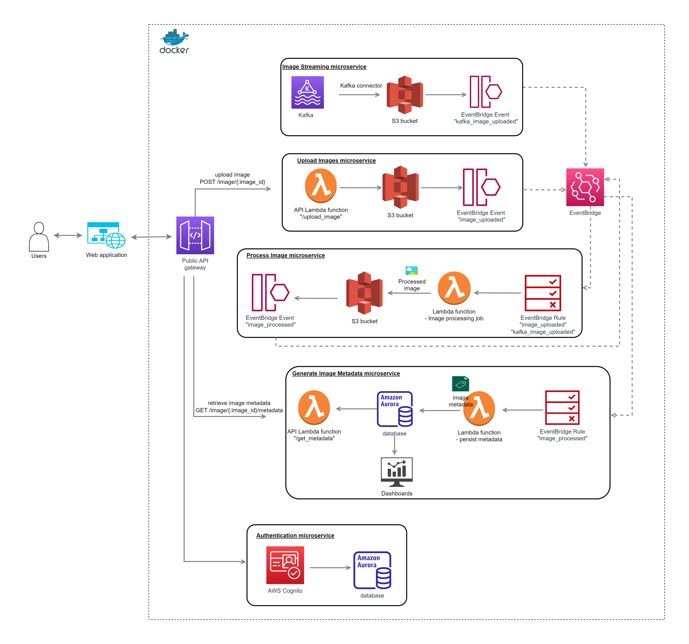

# Section 3: System Design

## Establish design scope
1) Core features
- users can upload image from several KB to up to several GB in size
- users can download processed images
- users can retrieve metadata for uploaded images
- processed images are stored for 7 days
- business users can obtain statistics and uploaded and processed images

2) System scale
- system can handle up to 100 TB of images
- service availability is 99.99%

3) Non-functional requirements
- Performance, modifiability, availability, scalability, reliability

## System Architecture
With these considerations in mind, the following architecture is proposed.

  

In this approach, a serverless microservice architecture using AWS is employed. Microservices allow each service to be independently scaled when the need arises. It also enables CI/CD for easy implementation of experimentations. Independent services increases the resiliency of an application.

### Components
#### 1) Lambda function
AWS lambda function is a fully managed serverless services provided by Amazon. Each Lambda function acts as a microservice and are connected by an API gateway.

#### 2) API Gateway
API Gateway allows client-to-microservices communications via HTTP. API gateway route the HTTP request to the desired microservices, after which command requests will be executed.

API Gateway also provides functionalities such as monitoring, load balancing which is important for the system.

#### 3) S3 bucket
S3 is an object storage service that can handle resource-intensive operations such as file uploading. S3 bucket can also be automatically scaled as our application grows. S3 can also provides 99.999999999% (11 nines) durability and 99.99% availability of objects over a given year.

Objects lifecycle in S3 can be set easily using the lifecycle policy. For example, we can put all processed images in a folder called `processed_images` and set the expiry rules to be 7 days from the day of creation.

#### 4) Amazon Aurora Serverless
Amazon Aurora functions as a relational database to store image metadata. Relational database is good for complex queries operations. Aurora offers better durability, scale and resilience compared to Amazon RDS. It will less likely be overwhelm by Lambda should there be a spike in traffic.

Users can perform query to obtain Business Intelligence information on key statistics including number and type of images processed, and by which customers. The query results can be feed into a dashboard such as Tableau that can be updated periodically.

#### 5) Amazon EventBridge
AWS EventBridge is a serverless event bus that can be used to decouple microservices with events and enables the communications between services. This type of communication is based on the publish/subscribe pattern in which EventBridge event publishes the events and EventBridge rule subscribes to the events.

Image processing engine can be cpu and gpu heavy and thus take up a lot of resources. Image processing can be made asynchronous with event-based architecture and thus avoiding issue such as API time-out.

### Steps
Users are authenticated with Amazon Cognito and then can proceeed to upload images to the site via API endpoints provided by the Amazon API gateway.

The Lambda function returns a image id to users once the uploading is completed.

The uploading emits a *image_uploaded* event via the EventBridge. Another Lambda function in the image-processing service is set to listen to this event and then process image accordingly. At the same time, the generate-metadata service is also set to listen to this event and then proceed to persist the image metadata in the Aurora database.

| APIs   |      Lambda function      |  
|----------|:-------------:|
| POST /v1/image |  UploadImage |
| GET/v1/image/{:image_id} |    FetchImageId   |
| GET /v1/image/{:image_id}  | DownloadImage  |
| GET /v1/image/metadata/{:image_id}  | FetchImageMetadata  |

## Pros
Serverless architecture provides scalability.
Image uploading is decoupled from image processing. Should any services go down, the other can still function and can be retried. The failure risk is lower.

A loosely coupled architecture can be built, which avoids bottlenecks caused by synchronous communication, latency, and input/output operations (IO).

AWS Lambda function is auto scalable.

## Limitations
Asynchronous calls are complex and harder to debug and maintain.

## References
1) https://jgefroh.medium.com/software-architecture-image-uploading-67997101a034  
2) https://www.appdynamics.com/topics/benefits-of-microservices  
3) https://docs.aws.amazon.com/prescriptive-guidance/latest/modernization-integrating-microservices/welcome.html  
4) https://aws.amazon.com/blogs/compute/best-practices-for-organizing-larger-serverless-applications/  
5) https://www.rehanvdm.com/blog/refactoring-a-distributed-monolith-to-microservices
